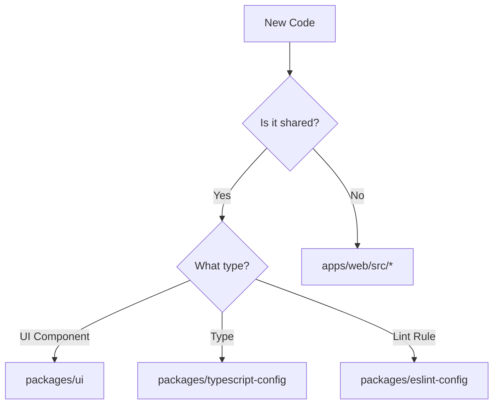

# AI Assistant Quick Reference

## Project Overview
Danky is an AI chatbot built with Next.js, React, TypeScript, and shadcn/ui, using a monorepo structure.

## Key Directories Quick Reference

### Apps
- `apps/web/src/components/*` - App-specific components
- `apps/web/src/lib/*` - Utilities and services
- `apps/web/src/app/*` - Next.js pages and layouts
- `apps/web/src/hooks/*` - React hooks

### Packages
- `packages/ui/*` - Shared UI components
- `packages/mcp/*` - Model Context Protocol
- `packages/eslint-config/*` - ESLint rules
- `packages/typescript-config/*` - TS configs

## Common Tasks

### 1. Adding New Components
```bash
# UI Component
pnpm ui:add [component-name]

# Feature Component
Create in: apps/web/src/components/[feature]/[component-name].tsx
```

### 2. File Location Decision Tree


### 3. Import Patterns
```typescript
// External packages
import { useState } from 'react'

// Internal packages
import { Button } from '@danky/ui'

// Local imports
import { useChat } from '@/hooks/use-chat'
```

## Quick Checks

### Component Location
- Generic UI → `packages/ui/src/components`
- Feature-specific → `apps/web/src/components/[feature]`
- Page-specific → `apps/web/src/app/[route]`

### State Management
- Server State → Server Components
- Client State → Zustand stores
- Form State → react-hook-form + zod

### Styling
- Component styles → Tailwind classes
- Theme variables → CSS variables in globals.css
- UI components → shadcn/ui

## Common Gotchas

1. **Server Components**
   - Default is server component
   - Need interactivity? Add 'use client'
   - Keep client bundles small

2. **Path Aliases**
   - `@/*` → src directory
   - `@danky/*` → workspace packages

3. **Type Safety**
   - Always use TypeScript
   - Validate with zod
   - No `any` types

4. **Component Size**
   - Keep under 200 lines
   - Split into subcomponents
   - Use composition

## Documentation Requirements

1. **New Components**
   - Follow `docs/templates/COMPONENT.md`
   - Document props and usage
   - Add examples

2. **New Features**
   - Follow `docs/templates/FEATURE.md`
   - Document architecture
   - Include data flow

3. **Configuration Changes**
   - Update `ARCHITECTURE.md`
   - Document in relevant package
   - Update templates if needed

## Best Practices Checklist

- [ ] Server vs Client component decision
- [ ] Proper directory placement
- [ ] TypeScript types defined
- [ ] Zod validation added
- [ ] Documentation added
- [ ] Tests considered
- [ ] Accessibility checked
- [ ] Performance optimized
