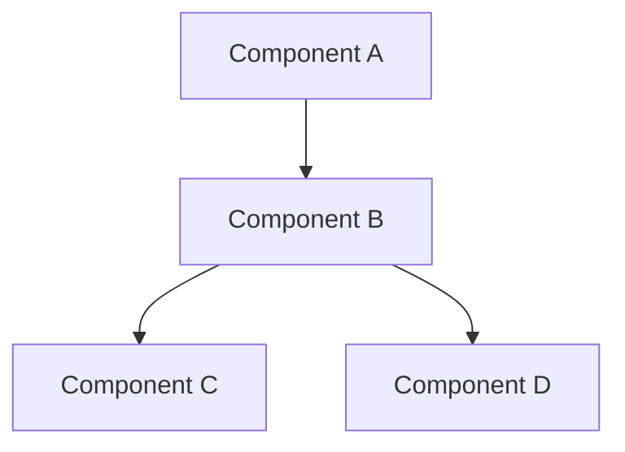

# Feature Name

## Purpose
Explain what this feature does and why it exists.

## Architecture


## Key Components
- `ComponentA` - Description
- `ComponentB` - Description
- `ComponentC` - Description

## Data Flow
1. Step 1 of data flow
2. Step 2 of data flow
3. Step 3 of data flow

## State Management
### Client State
```typescript
interface FeatureState {
  data: Data[]
  isLoading: boolean
  error: Error | null
}
```

### Server State
- Database tables used
- Cache considerations
- API endpoints

## Configuration
```typescript
interface FeatureConfig {
  enabled: boolean
  options: {
    // Feature-specific options
  }
}
```

## Dependencies
- External packages
- Internal packages
- Required services

## Usage Examples
```typescript
// Example code showing how to use the feature
```

## Testing
- Unit test approach
- Integration test approach
- E2E test considerations

## Performance Considerations
- Caching strategy
- Loading states
- Optimization techniques

## Security
- Authentication requirements
- Authorization checks
- Data validation

## Accessibility
- Keyboard navigation
- Screen reader support
- ARIA attributes

## Error Handling
- Common errors
- Error recovery
- User feedback

## Future Improvements
- Planned enhancements
- Known limitations
- Technical debt
